## Introduction

The goal of this project is to explore pigeon detection for the Balkonboeman: a connected device intended to help residents respond to pigeons on their balcony remotely.

This manual documents the technical experiments carried out from 1 to 7 October 2026, including the hardware setup, model training, errors and tested solutions.

The camera works with its existing person-detection model. The custom model detects pigeons in validation images in Google Colab, but has not yet been installed on the camera. Detection on my own balcony and the connection to notifications have not yet been tested.

## Required hardware and software

**Hardware:** Arduino Uno, Grove Base Shield, Grove Vision AI Module V1, Grove cable, USB cable for the Uno, USB-C cable for the camera, and a laptop.

**Software and services:** Arduino IDE, Seeed_Arduino_GroveAI library, Chrome, Google Colab, Google Drive, and Roboflow.

The NodeMCU ESP8266 and Telegram were used in an earlier, separate experiment. They have not yet been connected to the camera.

## Manual overview

- **Steps 1–5:** connecting the hardware and testing the camera.
- **Steps 6–14:** initial model training, errors, and solutions.
- **Steps 15–23:** recovering files, retraining, and comparing results.
- **Steps 24–25:** reviewing the final status.

## 1 Connecting and selecting the Arduino Uno

I connected the Arduino Uno to my laptop using USB. In Arduino IDE, I selected Arduino Uno as the board and selected its USB port. This was the basic check before using the camera.

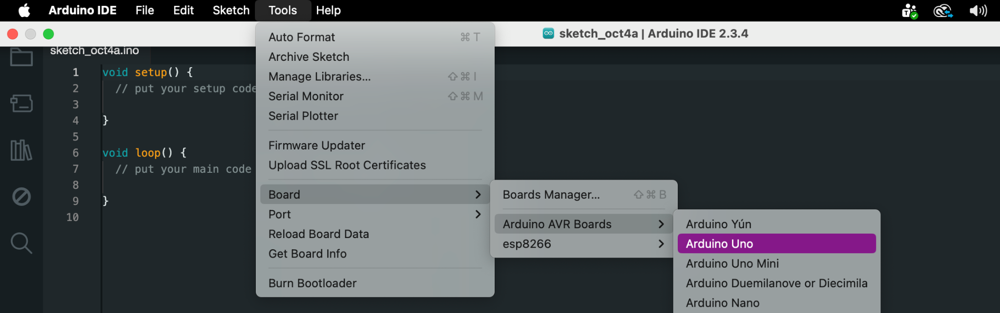

*Board selected: Arduino Uno.*

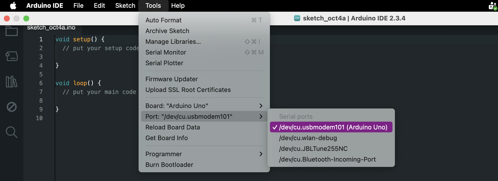

*The USB port associated with the Arduino Uno.*

**Checkpoint:** The Uno is connected, Arduino Uno is selected as the board, and the matching port is selected.

## 2 Running the Blink test

I opened the test through **File > Examples > 01.Basics > Blink** and uploaded it to the Uno. The orange LED further inside the board blinked steadily. This confirmed that the Blink test worked.

**Confusion:** The ON LED stayed on. This is the power indicator and is supposed to remain lit. I needed to watch the blinking L LED instead. I also recorded a video of the blinking LED.

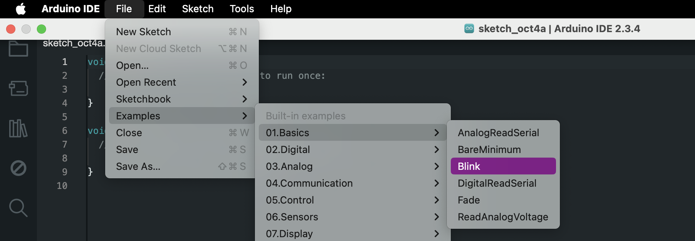

*Opening the Blink test in Arduino IDE.*

**Checkpoint:** The upload succeeds and the L LED blinks. ON is only the power indicator.

## 3 Connecting the Grove Vision AI camera

I used the Grove Vision AI module with the Arduino Uno and Grove Base Shield. The Grove cable was connected to an I2C socket. The camera was also connected to the laptop using USB-C. The photograph records the connections and the illuminated indicator.

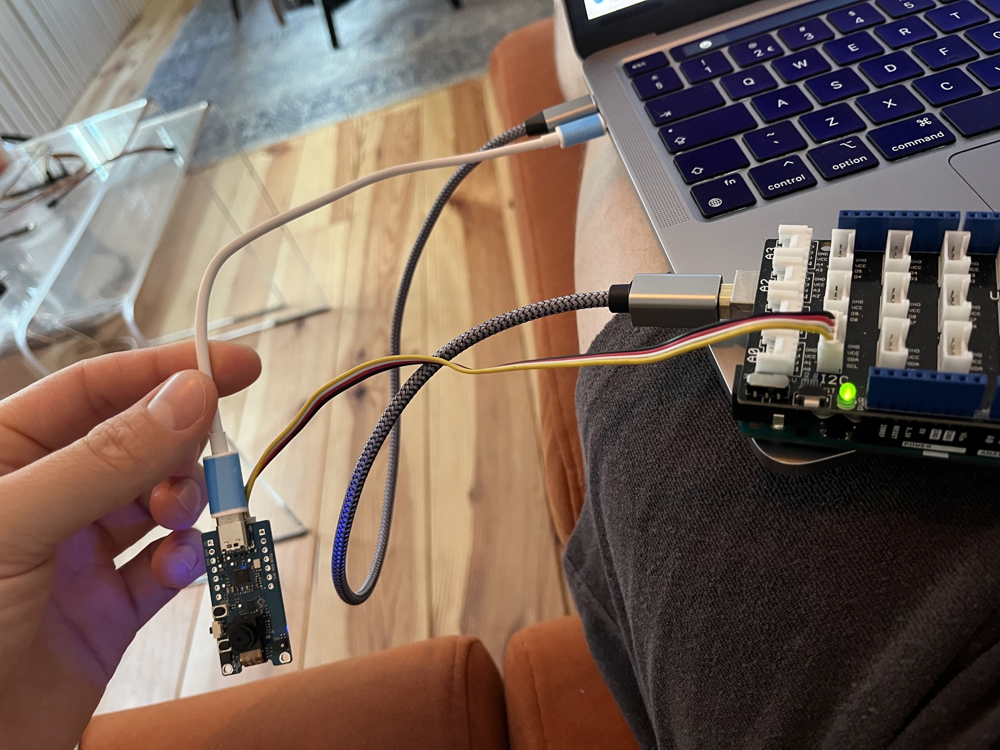

*My test setup: Uno with Grove Base Shield, camera, Grove cable, and USB connections.*

I used the **Seeed_Arduino_GroveAI** library and its **object_detection** example. This example read recognition results from the existing model; it was not yet a custom pigeon model.

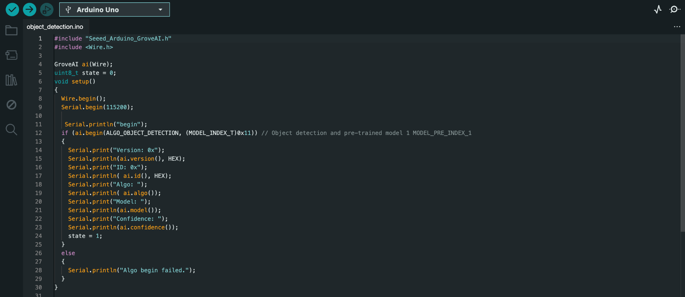

*The object_detection example in Arduino IDE.*

**Checkpoint:** The object_detection sketch is uploaded. The Grove camera is connected through I2C and through USB-C to the laptop.

## 4 Reading detection results

After uploading, I opened the Serial Monitor at **115200 baud**. Initially, messages appeared without a detection. When the camera recognised something as a person, it produced a detection result with a confidence score.

**Result:** The camera and Uno could exchange detection results. This demonstrated that the existing person-detection model worked, not that pigeons could already be detected.

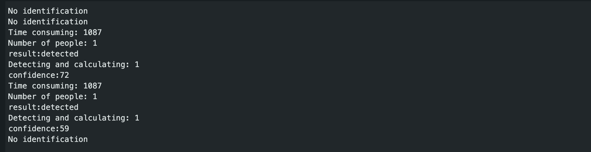

*Serial Monitor output showing person detection and a confidence score.*

**Checkpoint:** The Serial Monitor shows a detection result at 115200 baud.

## 5 Investigating camera viewer problems

Initially, the Seeed web interface showed no camera image. The model selection remained empty; clicking only highlighted the field in blue. Errors included **“Model Invalid Or Not Existent”** and an interrupted USB transfer. During an earlier attempt, the Serial Monitor had also displayed **“Invoke failed”** messages.

I checked the USB connections and tried reconnecting. Without the camera's USB-C cable, there was no camera image, so I reconnected it. I then checked the working detection in Arduino IDE and reopened the Seeed viewer. The live image appeared. The exact cause of all the earlier errors was not conclusively established.

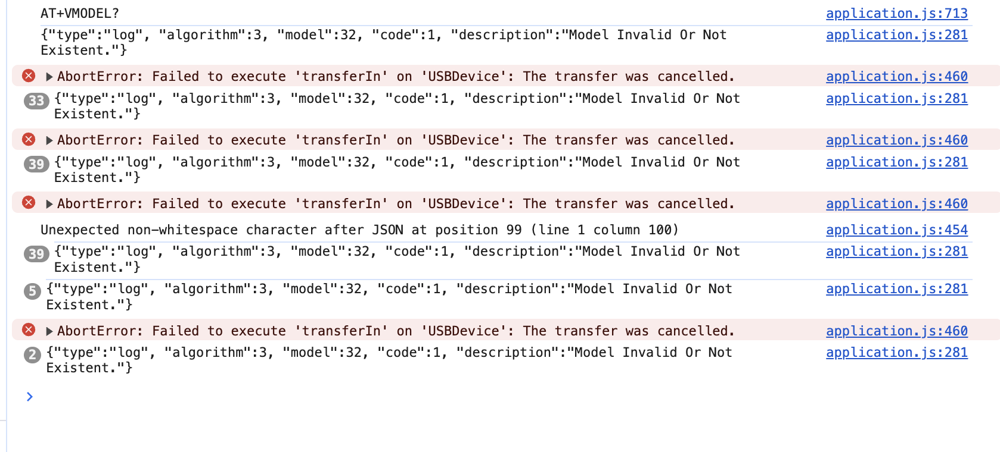

*Browser console errors during the unsuccessful connection.*

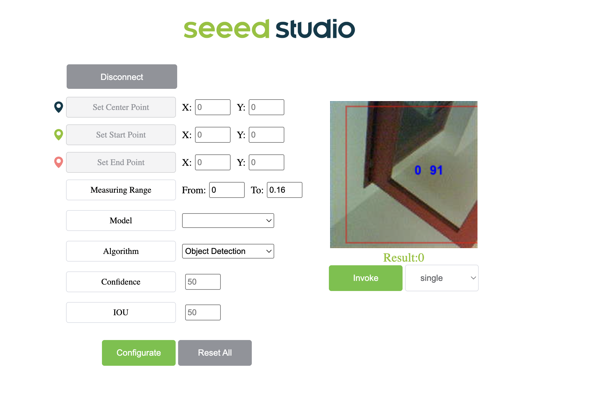

*The viewer subsequently displays a live camera image.*

**Important distinction:** The image changed when I moved the camera. A live image is different from recognition. Simply changing the word “person” to “pigeon” would not teach the model to recognise pigeons.

**Checkpoint:** The live image appears again. The exact cause of the earlier connection errors remains unknown.

## 6 Choosing a pigeon dataset

I selected the Roboflow **Pigeon dataset, version 3**, and the **YOLOv5 PyTorch** download format. The dataset contains two classes: **Crow** and **Pigeon**. The downloaded file was named `Pigeon.v3i.yolov5pytorch`.

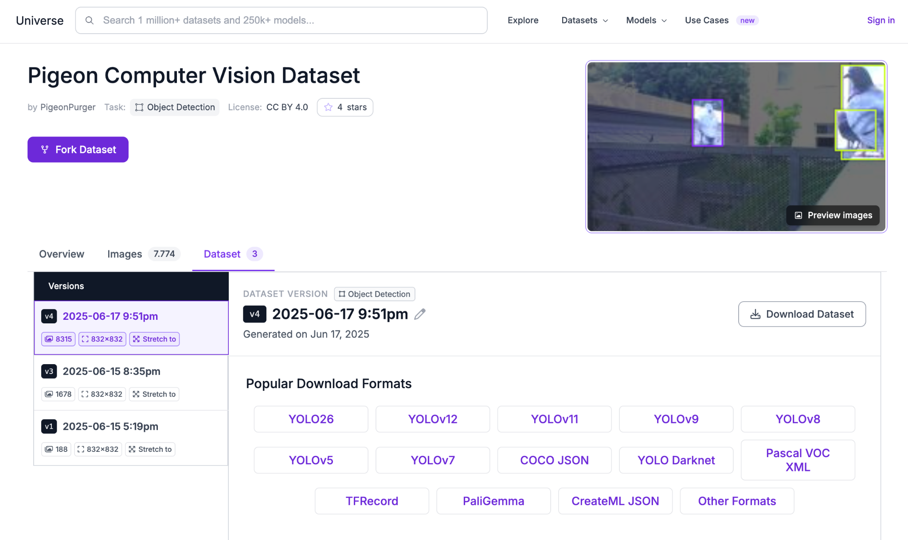

*Dataset download options in Roboflow.*

Later, I checked `data.yaml` in Colab. It contained the two classes and the paths to the training, validation, and test images. The dataset was located under `/content/datasets/Pigeon-3`.

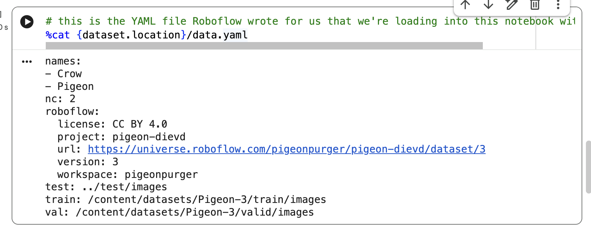

*Checking data.yaml: Crow and Pigeon, with the dataset paths.*

**Checkpoint:** Dataset version 3 is loaded; data.yaml contains Crow and Pigeon.

## 7 Preparing Google Colab

I worked with the Seeed YOLOv5 training notebook and made a copy in Google Drive. Training ran on a Colab runtime with a GPU. A check returned **“GPU available: True”**.

**Problem:** Colab reported “too many sessions” during the process. I had to resolve the session/runtime situation before continuing. The precise actions that cleared this message were not fully recorded.

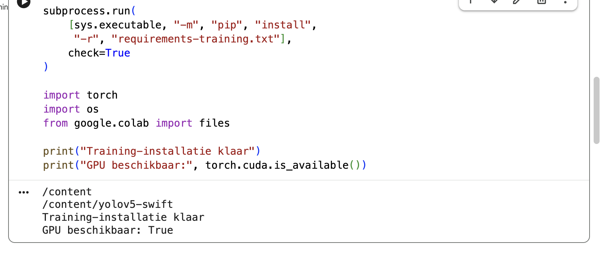

*Installation check confirming that a GPU was available.*

**Checkpoint:** Colab uses a GPU. The session-limit error and its exact solution were not fully recorded.

## 8 Resolving installation version problems

The older notebook instructions did not directly match the available software versions. Installing `tensorflow==2.9.0` failed because no matching version could be found. I checked the Python version, among other things, and adjusted the runtime/dependencies.

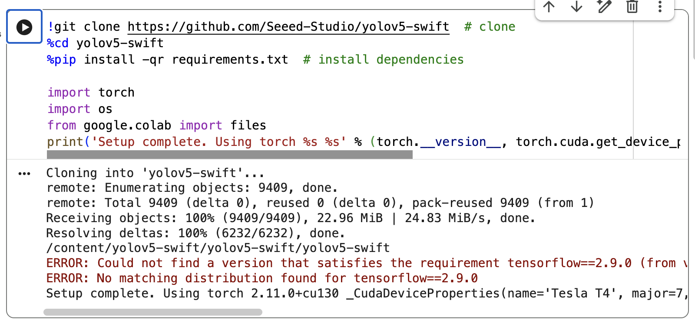

*Installation error involving the older TensorFlow version.*

NumPy was also adjusted. Colab requested a session restart because an earlier version was still loaded in memory. There were additional dependency warnings. I therefore do not consider the environment fully verified or free of issues, even though training eventually started.

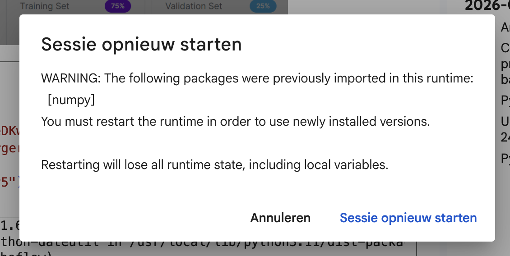

*Colab requests a restart after changes to installed packages.*

**Checkpoint:** Installation progressed after version adjustments. Dependency warnings remained.

## 9 Downloading the starting model and repairing older code

The Seeed starting model, `yolov5n6-xiao.pt`, downloaded successfully from GitHub. The download ended with “saved” and a file size of approximately 1.2 MB.

**Error:** PyTorch reported **“Weights only load failed”**. Starting with PyTorch 2.6, the default loading setting changed to `weights_only=True`. The older YOLO code expected a full checkpoint here. For the known Seeed source and my own checkpoints, I used the compatible loading setting. The exact training command used is recorded in the notebook.

The older code then failed on `np.int`, which is no longer available in newer NumPy versions. A repair cell replaced outdated references with `int`. A subsequent repair also reported “Updated: general.py” and “Repair complete”.

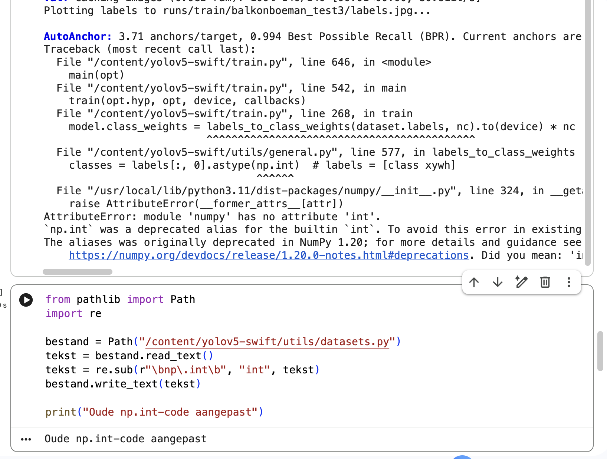

*The np.int error and the repair cell for the older code.*

**Checkpoint:** The starting model is downloaded and the np.int code is updated.

## 10 Training the custom model

After the repairs, training could continue. The completed test consisted of **30 epochs**: 30 passes through the training data. Results were saved in `runs/train/balkonboeman_test4`.

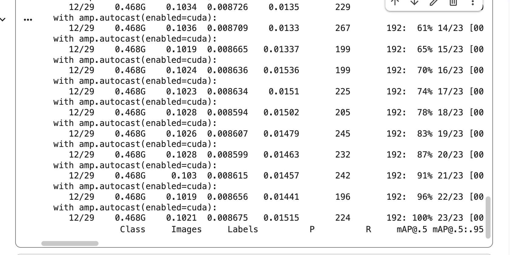

*Training continues to the final epoch of this test.*

During the first training run, **“FreeTypeFont has no attribute getsize”** appeared in `utils/plots.py`. The older plotting code did not match the installed Pillow version. On 5 October, this error had not yet been resolved. Training had nevertheless saved model files. On 7 October, I repaired the two getsize calls; see steps 18 and 19.

**Checkpoint:** The initial training completed 30 epochs; the plotting error remained at that point.

## 11 Checking the saved results

On 5 October, `weights/best.pt`, `weights/last.pt`, and `results.csv` were present. The CSV contained 30 epochs; epoch 29 was the thirtieth. Its final row contained the combined scores for both classes: **precision 0.63969, recall 0.14583, and mAP@0.5 0.069359**. These were not separate pigeon scores.

The final report by class showed **Pigeon recall of 0**. The model therefore found none of the labelled pigeons in that evaluation. The reported precision of 1 does not make this a reliable result. My conclusion was that a model file existed, but reliable pigeon detection had not been demonstrated.

**Checkpoint:** Model files and a CSV were present on 5 October, but Pigeon recall was 0.

## 12 Visually checking the dataset labels

To investigate the poor detection results, I drew the labelled bounding boxes over three training photographs. This showed where the labels were placed and which classes were used.

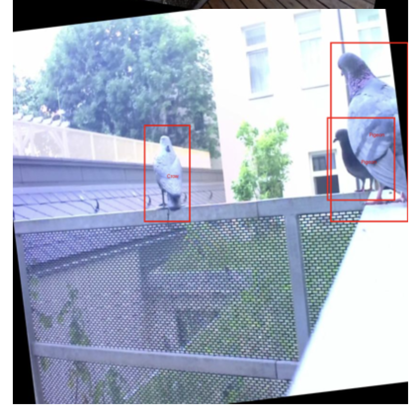

*A training photograph with its labelled bounding boxes drawn over it.*

My initial suspicion was that some labels were incorrect. Three photographs were insufficient evidence for that conclusion. On 7 October, I investigated further and found that Crow examples contained a plastic crow; see step 17. I did not change the labels.

**Checkpoint:** Three training photographs with bounding boxes were examined; the cause of poor detection had not yet been established.

## 13 Earlier separate NodeMCU and Telegram test

In an earlier test, I worked with the NodeMCU ESP8266 and the Telegram bot **Sandman**. Once the Wi-Fi and bot settings worked, Sandman responded to messages again. The code also contained commands for the built-in LED and a disco test for the LED strip.

This Telegram test was separate from the current camera setup. The connection between the camera, NodeMCU, and Telegram has not yet been implemented. Private Wi-Fi details and bot tokens are excluded from this manual.

## 14 Status after the initial tests on 5 October

**Working:** Uno upload and Blink test; reading results from the existing person-detection model; live camera images in the viewer; a training run with saved model files; and the earlier separate Telegram connection.

**Status on 5 October:** Reliable pigeon detection, running the custom model on the camera, forwarding camera detections to Telegram, and controlling a motor or speaker had not yet been demonstrated. The follow-up tests from 7 October appear below.

My next step was to investigate the dataset and detection quality. From step 15, I describe how I did this on 7 October.

## Follow-up tests on 7 October

I resumed my saved Colab notebook. My first goal was to investigate the poor pigeon detection and save the results persistently. The hardware did not need to be connected for these tests: training and predictions took place in Colab.

## 15 Checking whether the earlier files still existed

I checked for `data.yaml`, `weights/best.pt`, and `results.csv`. None of the three files remained at the previously used path. I then searched all of `/content` for the same filenames. This check also found nothing.

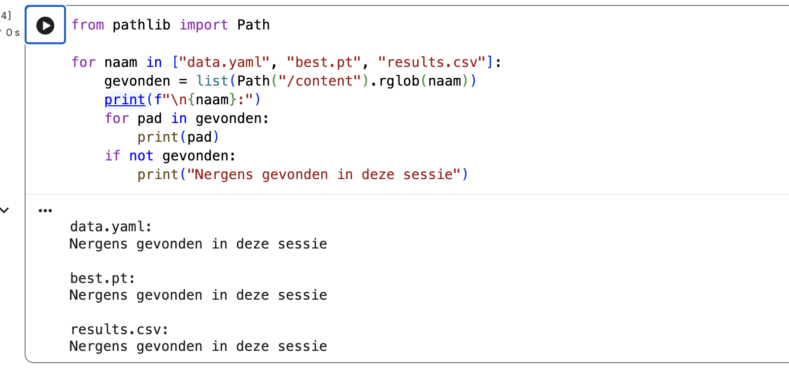

*The check finds no dataset, model, or results files in the current Colab session.*

I also searched Google Drive and my laptop. The Balkonboeman notebook I found contained code and saved output, but was not the model file best.pt. At that point, no copy of the trained model had been recovered.

**Likely cause:** The temporary Colab storage had been reset. The notebook had been saved, but the runtime files had not been stored persistently. Old output in the notebook was therefore not proof that those files were still available.

**Checkpoint:** The code and old results could still be read; the model files needed to be recreated. For the new training, I chose Google Drive storage.

## 16 Reloading the environment and dataset

In notebook **Step 2**, I ran the adjusted installation cell again. It used the Seeed yolov5-swift code, skipped the old TensorFlow and Keras version pins for training, and used NumPy below version 2. After waiting, the output showed “Training installation complete” and “GPU available: True”.

I then ran notebook Step 3 and the Roboflow cell in Step 4. I downloaded dataset version 3 again in YOLOv5 format. Checking data.yaml showed **Crow as class 0** and **Pigeon as class 1**, with the training directory `/content/datasets/Pigeon-3/train/images` and validation directory `/content/datasets/Pigeon-3/valid/images`.

**Checkpoint:** Installation is complete, a GPU is available, and data.yaml contains the correct dataset version. The API key remains private and must not appear in screenshots or a public manual.

## 17 Examining the dataset labels

I drew the original labelled bounding boxes over training photographs. I then examined six Crow examples and six Pigeon examples separately. These were dataset labels, not predictions from the model.

The Crow examples showed a plastic crow on a balcony. Several photographs were edited variants of the same image. This did not confirm the earlier suspicion that a crow label was incorrect: the object could be the bird scarer. I therefore did not arbitrarily change the labels or merge the classes.

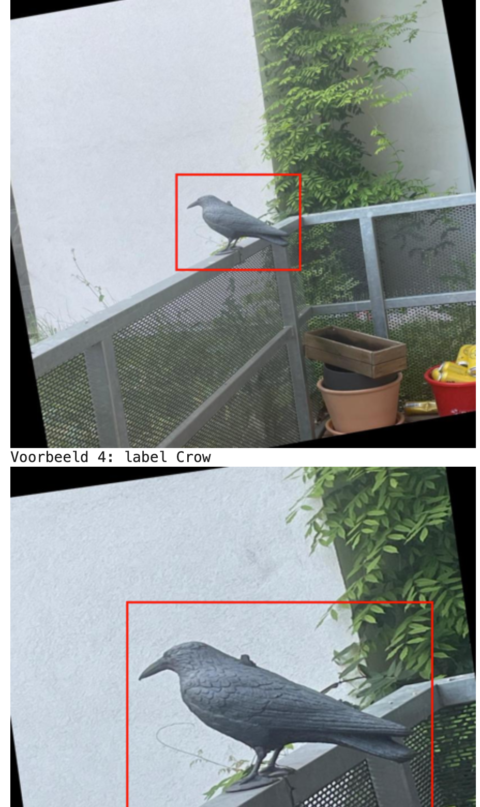

*The Crow examples show a plastic crow. Variants of the same photograph provide few new visual situations.*

The Pigeon examples had boxes around birds, but many pigeons were small and far away. The examples appeared suitable for further investigation; they do not prove that all labels in the dataset are correct.

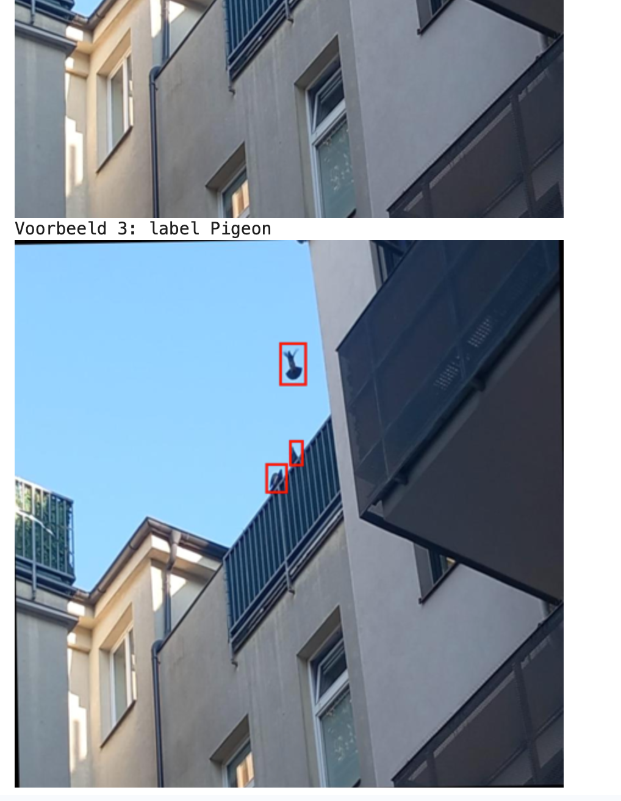

*Pigeon labels around small birds in the training images.*

**Checkpoint:** The class order was checked. Plastic crow and real pigeon remained separate classes. Small pigeons became a possible explanation to investigate further.

## 18 Repairing older code and connecting Drive

I replaced outdated `np.int` references with `int`. The repair reported two updated files: **datasets.py** and **general.py**. This needed to happen before training because newly downloaded project code did not include the earlier repairs.

I then connected Google Drive through `drive.mount("/content/drive")` and created `/content/drive/MyDrive/Balkonboeman`. Colab reported “Mounted at /content/drive” and “Save directory ready”. Creating the directory alone does not save a model; the training command therefore explicitly used this Drive location as its project directory.

I downloaded the trusted Seeed starting model, `yolov5n6-xiao.pt`. This is the original starting model, not my trained best.pt. For the newer PyTorch version, I used `TORCH_FORCE_NO_WEIGHTS_ONLY_LOAD=1` with the training command. I used this loading option only for the known source and my own checkpoints.

For the earlier Pillow error, I replaced `self.font.getsize(text)` with a calculation using `getbbox(text)`. This repaired one location, but later proved insufficient to cover all the plotting code.

**Checkpoint:** The NumPy repair is complete, Drive is connected, and the starting model is present. The Pillow repair still needed an additional change after the next test.

## 19 Retraining at 192 pixels

I trained again with the same starting model and dataset. Settings were **image size 192, batch size 64, and 30 epochs**. Results were saved to `/content/drive/MyDrive/Balkonboeman/training/duiven_test`. This kept best.pt, last.pt, and results.csv outside the temporary runtime storage.

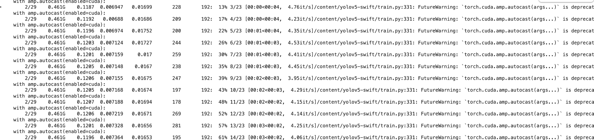

*The new training run progresses. FutureWarning messages do not stop training.*

Training completed all 30 epochs. Evaluation of best.pt gave **Pigeon precision 1, recall 0, and mAP@0.5 0.00164**. Crow recall was 0.666. Pigeon detection had therefore still not been demonstrated; precision 1 with recall 0 is not evidence of reliable recognition.

During evaluation, **“FreeTypeFont has no attribute getsize”** appeared again. This time the error was in box_label at `self.font.getsize(label)`. The first repair had only addressed getsize(text). I also repaired this second call using getbbox(label). Training did not need to run again for that repair.

**Checkpoint:** Both getsize calls are updated. best.pt, last.pt, and results.csv are all present in Drive.

## 20 Investigating predictions on validation photographs

I ran **detect.py** with the 192 model on the **140 validation photographs**. For diagnosis, I selected a low confidence threshold of **0.10**. Output was saved under `Balkonboeman/voorspellingen/controle`.

There were **40 label files**: 40 photographs with at least one prediction. An additional count found **62 Crow boxes across 40 photographs** and **0 Pigeon boxes across 0 photographs**. These counts describe how many predictions the model made, not how many were correct.

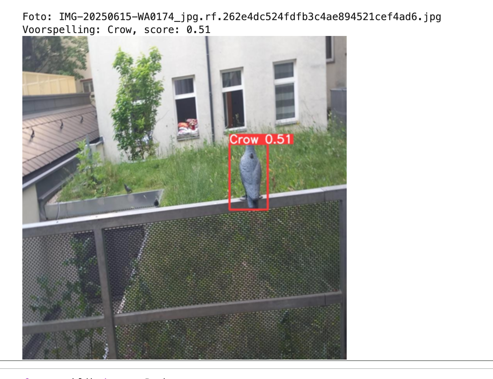

*The 192 model marks the plastic crow. Smaller pigeons receive no box in this example.*

**Checkpoint:** Even at a low threshold, no Pigeon predictions were found. The next step needed to be a targeted change rather than simply repeating the same training.

## 21 Investigating the size of the pigeons

I counted the labels per class and calculated the median shortest side of the bounding boxes at **192 × 192 pixels**. Pigeons were much more numerous than crows, but occupied fewer pixels.

| Dataset split | Class | Number of labels | Median shortest box side |
| --- | --- | --- | --- |
| Train | Crow | 474 | 29.3 px |
| Train | Pigeon | 3236 | 9.5 px |
| Validation | Crow | 48 | 27.2 px |
| Validation | Pigeon | 275 | 8.7 px |

My hypothesis was that the small image size left too little detail to recognise pigeons effectively. The count did not prove that this was the only cause. I therefore chose one controlled change: repeating the training at **384 pixels**.

**Checkpoint:** The hypothesis and change were specific: double the input resolution while keeping the dataset, starting model, batch size, and number of epochs unchanged.

## 22 The experiment at 384 pixels

I trained again with `--img 384`, batch size 64, and 30 epochs. The new directory was `Balkonboeman/training/duiven_384_test`. The 192 model remained stored separately. The 384 model was evaluated on the same validation set after training.

| Pigeon metrics on the validation set | 192 model | 384 model |
| --- | --- | --- |
| Precision | 1 with recall 0 | 0.691 |
| Recall | 0 | 0.538 |
| mAP@0.5 | 0.00164 | 0.558 |

For the 384 model, pigeon recall was **53.8%** and precision was **69.1%** in this evaluation. Recall describes the proportion of labelled pigeons found at the operating point selected by the evaluation. Precision describes the proportion of predicted pigeons that were correct at that point. These values are not automatically the same as those from the separate photograph test with a threshold of 0.25. The model misses pigeons and makes incorrect predictions.

This comparison supports my hypothesis about image size. A single run per setting does not rule out other influences. The validation photographs come from the same dataset, and many images look similar. Performance on my own balcony and on genuinely new situations has not yet been tested.

**Checkpoint:** Pigeon detection in Colab is demonstrated on validation images. Compatibility of the 384-pixel model with the Grove module and reliable operation in my situation have not yet been demonstrated.

## 23 Checking the predicted photographs

I ran detect.py with the 384 model, image size 384, and a confidence threshold of **0.25**. All 140 validation photographs were processed. There were **134 label files** in `Balkonboeman/voorspellingen/controle_384`: at least one prediction on 134 photographs. This is not an accuracy percentage.

I examined six photographs with Pigeon predictions. Example 6 shows a well-positioned box around a pigeon with a score of **0.62**. Example 4 shows a pigeon with a score of **0.72**, while other visible birds received no box. In example 5, a weak prediction of **0.29** appeared to mark background; pigeons at the bottom right remained unmarked.

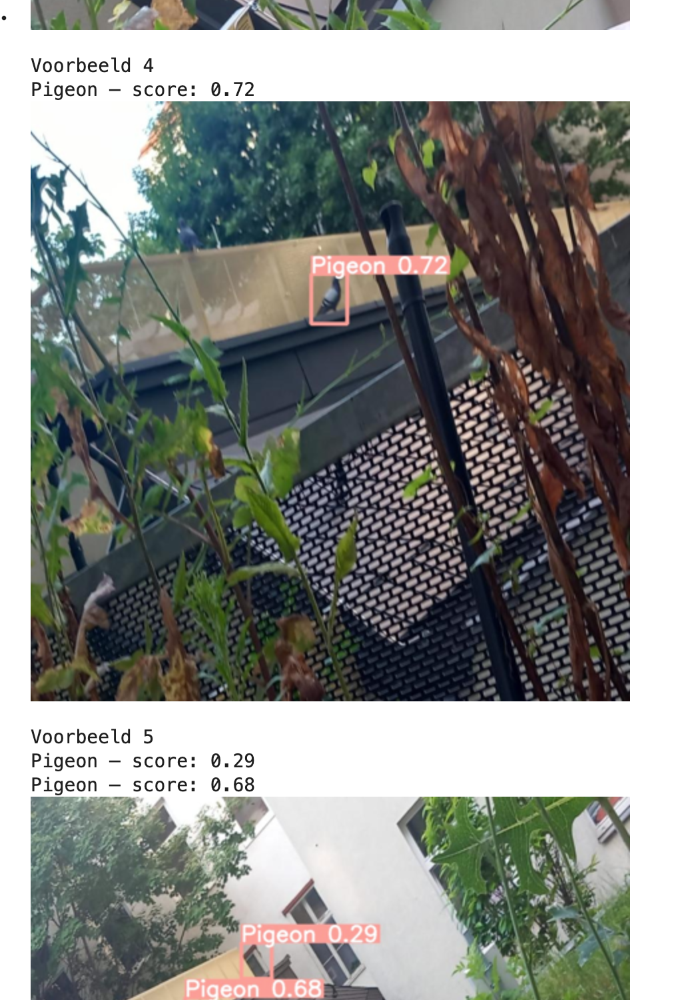

*Example 4: a pigeon is detected, but not all other visible birds are marked.*

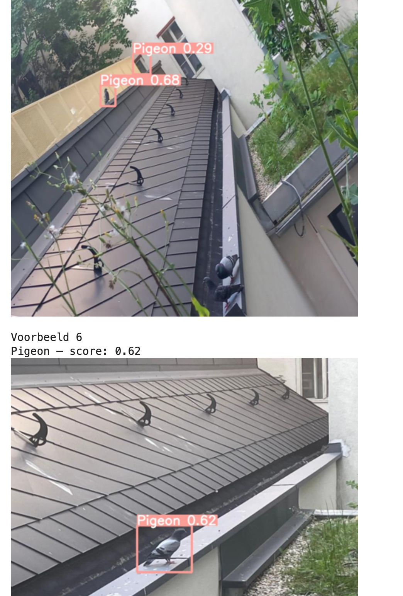

*Top: a suspected false detection and missed pigeons. Bottom: example 6 with a clear box around a pigeon.*

**Checkpoint:** There are visual examples of both success and limitations. The model must not yet be presented as error-free detection or as a fully working Balkonboeman.

## 24 Final status

**Working and tested:** The Uno Blink test, existing person detection and camera viewer, rebuilding the Colab environment, model training at two resolutions, storage in Drive, and pigeon predictions on validation photographs. The earlier NodeMCU test with Telegram worked separately.

**Not yet implemented:** Exporting and installing the custom model on the Grove camera, reading camera data with the NodeMCU, sending a camera detection through the Telegram Bot API, and controlling a physical bird-scaring action. The Uno has no built-in Wi-Fi. The current camera experiment therefore does not yet demonstrate a complete server/API connection from the hardware.

My technical next step would be to check the model's hardware compatibility. I could then export it, test it on the camera, read detection data using the Wi-Fi controller, and only then connect a Telegram notification. Additional training results do not prove that this connection already works.

## Sources and evidence

- [Arduino Uno instructions from the lecturer](https://github.com/harmsel/SensorLab/blob/main/MicroControllers/Arduino_UNO.md)
- [Grove Vision AI Module documentation](https://wiki.seeedstudio.com/Grove-Vision-AI-Module/)
- [Grove Base Shield documentation](https://seeeddoc.github.io/Grove-Base_shield_v2/)
- [Seeed YOLOv5 code and starting model](https://github.com/Seeed-Studio/yolov5-swift)
- [Roboflow Pigeon dataset version 3](https://universe.roboflow.com/pigeonpurger/pigeon-dievd/dataset/3) — dataset licence: CC BY 4.0.
- [PyTorch documentation related to the loading error](https://pytorch.org/docs/stable/generated/torch.load.html)

